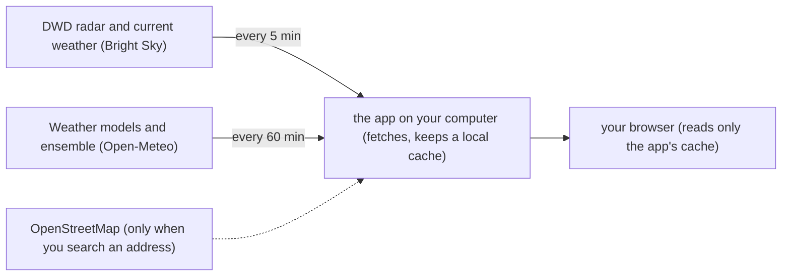

# Local Rain Forecast

A self-hosted rain forecast for one place — your home — that answers the question **"Will it rain in the next hour?"** It combines the DWD weather radar with six weather models and a 50-member ensemble, all from free data sources that need no account and no API key, and it runs entirely on your own computer (a Linux PC, a Raspberry Pi, or Docker Desktop on Mac/Windows).

## How it works



In words: the app on your computer fetches the radar and current weather every 5 minutes and the model forecasts plus the ensemble every 60 minutes, and keeps a local copy of everything. Your browser only ever reads that local copy — opening or refreshing the page never asks the weather services for anything new.

## What you see

Once a location is set, the page shows:

- **The big number at the top** — the chance of rain in the next 60 minutes, with an explanation line below it.
- **Now** — the current conditions at your location.
- **Next 60 min · DWD radar** — a bar with one segment per 5 minutes showing what the radar expects in the next hour.
- **Next 24 h · model comparison** — a line per weather model, comparing what each one predicts over the next 24 hours.
- **Model accuracy** — how well each model's past forecasts have matched what actually happened; it fills up over the first days.
- **Data sources** — for each source, how old the cached data is, and a **stale** flag when it has gone too old.
- **The countdown strip under the header** — three live timers: the next radar fetch ("Radar & now"), the next model fetch ("Models & ensemble") and the next page reload ("This page").

## What you need

- **Podman** (with podman-compose) or **Docker** (with Compose), on the machine that will run the app.
- An **internet connection** — the weather data is downloaded from two free services.
- **About 200 MB of disk** for the container image (a container image is the packaged software the app runs in, and a container is the running instance of it, isolated from the rest of your computer), plus a little extra for the cached data.
- **At most 512 MB of RAM** while it runs.

One geographic limit: **the radar covers Germany only.** Elsewhere the app automatically drops the radar from the calculation and computes the rain chance from the weather models and the ensemble alone — the page tells you when that is the case.

## Install and first start

Get the code onto your machine:

```bash
git clone <repo-url>
```

Change into the folder it created, then start the app:

```bash
cd <folder>
podman compose up -d --build
```

With Docker the same command is:

```bash
docker compose up -d --build
```

This builds the container image if needed and starts the app in the background. Now open `http://localhost:8000` in your browser.

**The setup wizard appears**, because the app ships without a location. It is titled "Set your location" and explains: "Pick the spot this app watches for rain." You have two ways to set it:

- **Search an address or place.** Type at least 3 characters (for example `Marienplatz 1, München`) and press **Search** (or Enter). Matching results appear below the field; click the one that is yours. If only one matches, it is selected automatically.
- **Enter coordinates.** Type the latitude and longitude into the two fields; pasting `48.137, 11.575` into either field fills both.

Then **check the timezone** (it is prefilled from your browser) and press **Save location**. The location is stored in the app's database, and the first data appears within seconds. From now on, the 📍 button in the header reopens the wizard.

Two notes from the wizard itself: the address search sends the text you type to OpenStreetMap's Nominatim from the app, and the radar covers Germany only — elsewhere the forecast uses the weather models only.

## Reading the page

The explanation line under the big number shows how the chance was built. A typical line reads:

> Radar: yes; 3 of 6 models predict > 0.1 mm in the next hour; ensemble 42 %

It has three parts: what the radar currently sees ("Radar: yes", "Radar: no" or "Radar: not available" outside Germany), how many of the six weather models predict more than 0.1 mm of rain in the next hour, and the **ensemble** figure — the share of the 50 ensemble members that forecast rain. If you switch on accuracy weighting (see below), the line also says "accuracy-weighted".

On the **Data sources** card, **stale** means the cached copy is older than the freshness limit (10 minutes for the radar, 2 hours for the models) — the app keeps showing the old data rather than nothing, and keeps retrying. **No data** means the app has not yet managed a successful fetch from that source.

The radar is updated every 5 minutes and the models every hour; the countdown strip under the header shows when the next fetch happens and when the page reloads with fresh data.

The **Model accuracy** card compares each model's past forecasts with the observations, hour by hour. It needs about 2 days of comparisons before the numbers mean anything.

If you want to know exactly how the percentage is combined, see [docs/ARCHITECTURE.md](docs/ARCHITECTURE.md).

## Everyday tasks

### Open it from your phone or another computer

From another device on your network, use the machine's IP address, `http://<ip>:8000` — on Linux you find it with:

```bash
hostname -I
```

— or the machine's local name, `http://<computer-name>.local:8000`. Any other name (for example a router name like `pi.fritz.box`) has to be added to `ALLOWED_HOSTS` in `docker-compose.yml` — there is a commented example right in the file — otherwise the browser shows "Invalid host header".

### Change the location

The 📍 button in the header reopens the setup wizard. Changing the location deletes the cached data and the model-accuracy history; the app asks before it does that.

### Use another port

```bash
PORT=9000 podman compose up
