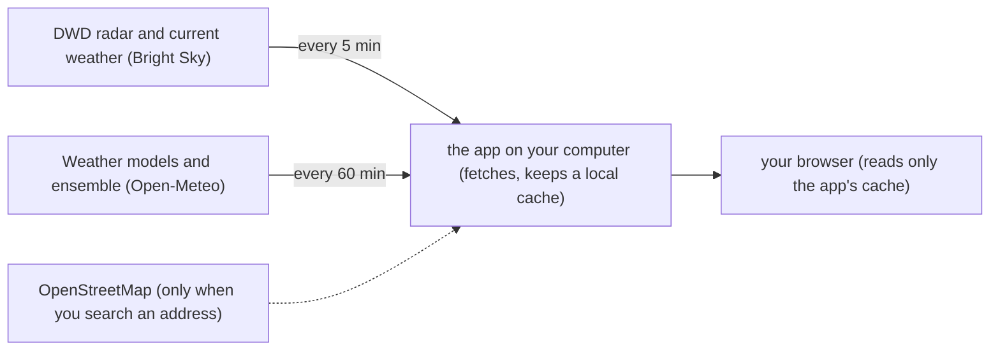

# Local Rain Forecast

A self-hosted rain forecast for one place — your home — that answers the question "Will it rain in the next hour?". It combines the DWD weather radar with six weather models and a 50-member ensemble, all from free data sources that need no account and no API key, and it runs entirely on your own computer (a Linux PC, a Raspberry Pi, or Docker Desktop on Mac/Windows).

## How it works



In words: the app on your computer fetches the radar and current weather every 5 minutes and the model forecasts plus the ensemble every 60 minutes, and keeps a local copy of everything (a cache). Your browser only ever reads that local copy — opening or refreshing the page never asks the weather services for anything new.

## What you see

Once a location is set, the page shows, in English or German (following your browser's language):

- **The answer at the top** — one sentence such as "Rain likely in the next hour", with what the radar sees ("Radar: rain from 12:55 PM to 1:05 PM"), the chance of rain in the next 60 minutes as a big number, and a strip with one segment per 5 minutes showing the strongest rain the DWD radar expects near you.
- **Now** — the current conditions at your location (temperature, weather, wind, gusts, humidity, pressure, dew point, clouds, rain in the last hour).
- **Next 24 hours** — a line per weather model, comparing what each one predicts over the next 24 hours (or one line saying no rain is expected).
- **Details** (closed until you open it) — the signals and weights behind the number, three live timers (the next radar fetch, the next model fetch, the next page reload), the data sources with the age of each one, and the model accuracy table.

The header has the location button (a map pin) to change the location and a button to switch between light and dark (the page follows your system setting until you use it).

**Wall display:** open `http://localhost:8000/?kiosk` on a landscape tablet or TV. That view fits on one screen without scrolling, with large type: the answer on the left, Now and the 24-hour chart on the right; it leaves out the Details.

## What you need

- **Podman** (with podman-compose) or **Docker** (with Compose), on the machine that will run the app. A *container* is the isolated little environment the app runs in, and the *volume* is the app's data store on your disk.
- An **internet connection** — the weather data is downloaded from free services.
- **About 200 MB of disk** for the container image, plus a little extra for the cached data.
- **About 50 MB of RAM** while it runs.

One geographic limit: **the radar covers Germany only.** Elsewhere the app automatically drops the radar from the calculation and computes the rain chance from the weather models and the ensemble alone — the page tells you when that is the case.

## Install and first start

Get the code onto your machine:

```bash
git clone <repo-url>
```

Change into the folder it created, then start the app:

```bash
cd <folder>
podman compose up -d --build
```

With Docker the same command is:

```bash
docker compose up -d --build
```

This builds the container image if needed and starts the app in the background. Now open `http://localhost:8000` in your browser.

**The setup wizard appears**, because the app ships without a location. It is titled "Set your location" and explains: "Pick the spot this app watches for rain." You have two ways to set it:

- **Search an address or place.** Type at least 3 characters (for example `Marienplatz 1, München`) and press **Search** (or Enter). Matching results appear below the field; click the one that is yours. If only one matches, it is selected automatically.
- **Enter coordinates.** Type the latitude and longitude into the two fields; pasting `48.137, 11.575` into either field fills both.

Then **check the timezone** (it is prefilled from your browser) and press **Save location**. The location is stored in the app's data store, and the first data appears within a few seconds. From now on, the map-pin button in the header reopens the wizard.

Two notes from the wizard itself: the address search sends the text you type to OpenStreetMap's Nominatim from the app, and the radar covers Germany only — elsewhere the forecast uses the weather models only.

## Reading the page

Open **Details** to see how the chance was built. **Signals and weights** has two lines, for example:

> Radar 50% · Models 30% · Ensemble 20%<br>
> Radar: raining · Models: 3 of 5 · Ensemble: 35%

The first line is how much each signal counts; the second is what each one says right now: whether the radar sees rain near you, how many of the weather models predict more than 0.1 mm of rain in the next hour, and the **ensemble** figure — the share of the 50 ensemble members that forecast rain. Outside Germany there is no radar, and its weight goes to the other two.

Under **Data sources**, each row names the part of the page it feeds (Radar, Now, Models, Ensemble) and the service it comes from. **stale** means the cached copy is older than the freshness limit (10 minutes for the radar, 2 hours for the models) — the app keeps showing the old data rather than nothing, and keeps retrying. **n/a** means the app has not yet managed a successful fetch from that source.

The radar is updated every 5 minutes and the models every hour; the timers under **Details** show when the next fetch happens and when the page reloads with fresh data.

The **Model accuracy** table compares each model's past forecasts with the observations, hour by hour. It needs about 2 days of comparisons before the numbers mean anything.

If you want to know exactly how the percentage is calculated, see [docs/ARCHITECTURE.md](docs/ARCHITECTURE.md).

## Everyday tasks

### Open it from your phone or another computer

From another device on your network, use the machine's IP address, `http://<ip>:8000` — on Linux you find it with:

```bash
hostname -I
```

— or the machine's local name, `http://<computer-name>.local:8000`. Any other name (for example a router name like `pi.fritz.box`) has to be added to `ALLOWED_HOSTS` in `docker-compose.yml` — there is a commented example right in the file — otherwise the browser shows "Invalid host header".

### Change the location

The map-pin button in the header reopens the setup wizard. Changing the location deletes the cached data and the model-accuracy history; the app asks before it does that.

### Use another port

```bash
PORT=9000 podman compose up -d
```

### Stop and start the app

```bash
podman compose down
```

stops the app. **Your data is kept** — it lives in the volume, not in the container. Start it again with:

```bash
podman compose up -d
```

(Docker: `docker compose down` / `docker compose up -d`.)

### Start automatically after a reboot

With Docker this works on its own. With Podman, run these two commands once:

```bash
sudo loginctl enable-linger $USER
systemctl --user enable podman-restart.service
```

The first lets your user's services run at boot without anyone logging in; the second starts the app's container at boot. After the next reboot, `podman ps` should list `weather-app`. A container you removed with `podman compose down` stays off until you start it again.

### Update to a new version

```bash
git pull
```

then rebuild and restart:

```bash
podman compose up -d --build --force-recreate
```

With Docker it is `docker compose up -d --build`. The `--force-recreate` is the important part for Podman: podman-compose keeps the old container when only the image changed, so without the flag the update would silently not take effect. Docker Compose replaces the container on its own.

### See the log

```bash
podman logs -f weather-app
```

shows what the app is doing, one line at a time; stop it with Ctrl+C. With Docker it is `docker logs -f weather-app`.

### Back up and restore your data

Everything the app stores (location, cache, accuracy history) lives in a volume named after the folder — for a folder called `wetter` it is `wetter_weather-data`. Check your name with `podman volume ls`. To back it up:

```bash
podman volume export wetter_weather-data > weather-backup.tar
```

To restore it later (for example on a new machine):

```bash
podman compose down
podman volume import wetter_weather-data weather-backup.tar
podman compose up -d
```

Docker has no `volume export`; instead use a temporary container:

```bash
docker run --rm -v wetter_weather-data:/data:ro -v "$PWD":/backup alpine tar cf /backup/weather-backup.tar -C /data .
```

### Uninstall

```bash
podman compose down -v
```

removes the app **and all of its data** (the volume). Do this only after you made a backup you want to keep.

## Settings you might change

| Setting | Where | Notes |
| --- | --- | --- |
| Radar radius | `radar.radius_km` in `weather.yaml` (currently `1.0`) | How close the radar has to see rain for it to count as "local rain". After changing it, rebuild so the file is baked into the image again: `podman compose up -d --build --force-recreate` (Docker: `docker compose up -d --build`). |
| Port | `PORT=9000 podman compose up -d` | Any free port on your machine. |
| Extra host names | `ALLOWED_HOSTS` in `docker-compose.yml` | Needed when you open the app under a name that is not the IP or the `.local` name (see above). |
| Accuracy weighting | `USE_ACCURACY_WEIGHTS: "true"` under `environment:` in `docker-compose.yml` | Off by default. Worth turning on after about 2 days, once the Model accuracy card has enough history. |

For everything else (weights, models, refresh cadence, accuracy window) see [docs/DEVELOPMENT.md](docs/DEVELOPMENT.md).

## Privacy and security, in plain words

- The app runs only on your computer. There is no account, no login, no tracking, and nothing about you is sent to the app's author.
- To get your forecast, your coordinates are sent to the weather services (Bright Sky/DWD and Open-Meteo). If you use the address search, the text you type is sent to OpenStreetMap's Nominatim **from the app's server**, not from your browser. Coordinates you type in yourself are sent to the weather services and nowhere else.
- The app is meant for your home network. **Don't open or forward its port on your router.** Anyone on your home network can open the page and change the location.
- For the technical details, see [docs/SECURITY.md](docs/SECURITY.md).

## Troubleshooting

- **The browser shows "Invalid host header".** The name you opened the app under is not one the app answers to. Use the IP or the `.local` name, or add the name to `ALLOWED_HOSTS` in `docker-compose.yml` and start again.
- **The page says "Could not reach the API. Refreshing…".** The app is not running. Check with `podman ps` (Docker: `docker ps`) whether the `weather-app` container is up, and look at the log (`podman logs -f weather-app`).
- **Everything shows "stale" or "no data".** The app can't reach the weather services — check your internet connection — or it has only just started. Look at the Data sources card (it shows the last error per source) and the log.
- **The radar card says "Radar not available for this location (models-only display)."** Your location is outside the radar's coverage area (Germany). The forecast still works — it uses the weather models only.
- **Starting fails with "Address already in use"** (or a similar port-busy message). Something else already uses port 8000. Start with another port: `PORT=9000 podman compose up -d`.
- **After updating an old install, the log shows "unable to open database file".** Installs from before the app switched to a non-root user need a one-time fix for the data volume — the command is in [docs/SECURITY.md](docs/SECURITY.md).

## Data sources and credits

- **DWD radar and current weather** via [Bright Sky](https://brightsky.dev).
- **Weather models and ensemble** from [Open-Meteo](https://open-meteo.com), free for non-commercial use.
- **Address search** by OpenStreetMap Nominatim — © [OpenStreetMap contributors](https://www.openstreetmap.org/copyright).

## For developers

- [docs/ARCHITECTURE.md](docs/ARCHITECTURE.md) — how the rain probability is calculated, data conventions, project layout.
- [docs/API.md](docs/API.md) — the endpoints and the response contract.
- [docs/SECURITY.md](docs/SECURITY.md) — the security setup and the one-time volume migration for old installs.
- [docs/DEVELOPMENT.md](docs/DEVELOPMENT.md) — running without Docker, tests, all settings.
- [docs/SCOPE.md](docs/SCOPE.md) — purpose, features and requirements.

The project is developed with an AI coding agent; its rules are in `.continue/rules/weather-projectrules.md` (see [docs/DEVELOPMENT.md](docs/DEVELOPMENT.md)).

## License

The code is released under the [MIT License](LICENSE). The weather and map data belong to their providers and follow their own terms (see [Data sources and credits](#data-sources-and-credits)).
