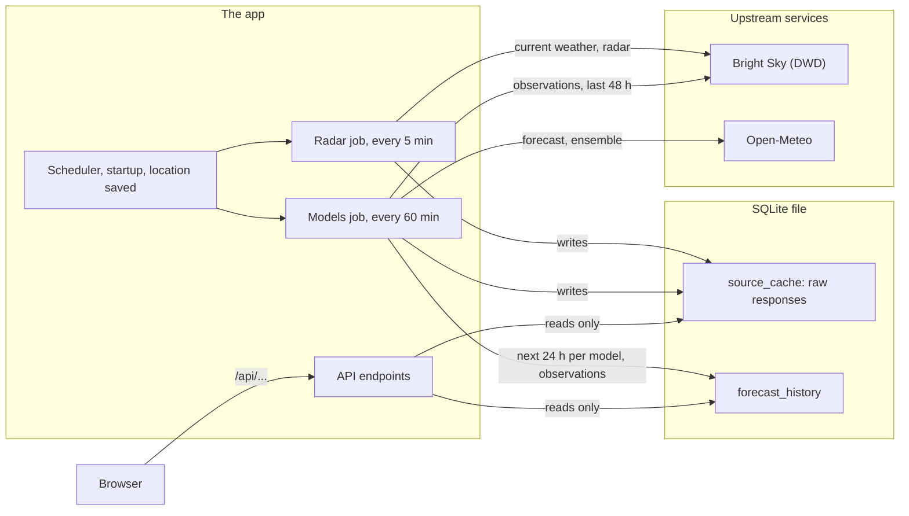
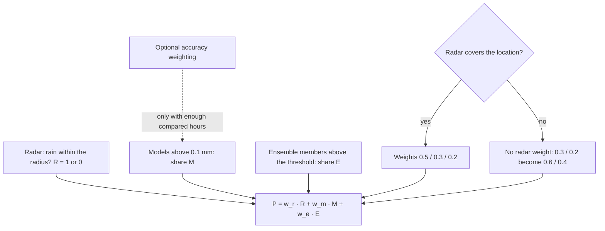
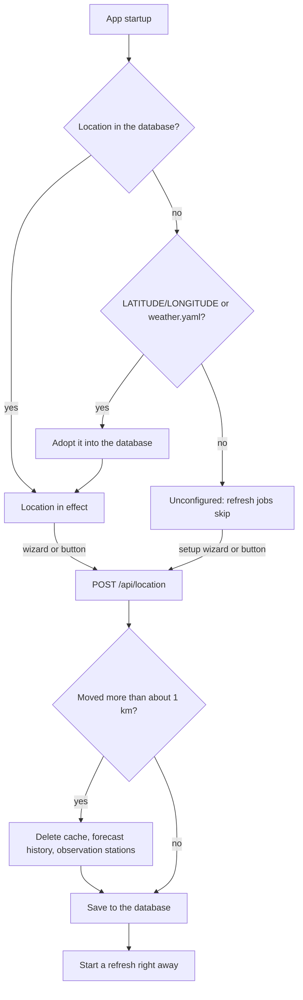

# Architecture

How the app works, for developers: how the rain probability is calculated, the data conventions of the upstream sources, and the project layout.

## Data flow

The scheduler keeps the local cache and history up to date, and the browser only ever reads from them — never from the upstream services.



## How the rain probability is calculated

Three independent signals for the **next 60 minutes**, combined linearly:

1. **Radar nowcast** (highest weight, default 0.5) — the DWD radar grid is scanned for cells within `radar.radius_km` of your location. If any cell in the relevant 5-minute steps exceeds the rain threshold, radar "votes rain" (binary 0/1).
2. **Model agreement** (default 0.3) — each configured Open-Meteo model sums its 15-minute precipitation for the next hour; the signal is the *share* of models forecasting more than `model_rain_threshold_mm` (0–100 %).
3. **Ensemble probability** (default 0.2) — share of ECMWF ensemble members (50) whose precipitation for the next hour exceeds the threshold. The ensemble has hourly data only, so it uses the hour that overlaps the next 60 minutes the most (the first hourly step stamped `>= now + 30 min`).

The three signals are combined in one weighted sum, with a fallback when radar has no coverage and an optional accuracy weighting for the model signal:



```
P = w_r * R + w_m * M + w_e * E          (weights renormalized to sum 1)
```

- `R` = 1 if radar sees rain nearby, else 0
- `M` = (models with rain) / (models available)
- `E` = (members with rain) / (members available)

**Fallback (no radar coverage, e.g. outside Germany):** `w_r` is dropped and the remaining weights are re-normalized automatically (0.3/0.2 becomes 0.6/0.4). The UI always shows the derivation, e.g. "Radar: yes, 3 of 5 models, 42 % ensemble".

**Scoring the models (`GET /api/model-accuracy`):** MAE alone is misleading — during a dry spell a model that always says 0 mm has a near-zero MAE without ever being right about rain. So each model is scored on the *same yes/no event* the vote uses (``> model_rain_threshold_mm``), over the last `accuracy.window_days` days: `hits` (rain forecast, rain observed), `misses`, `false_alarms`, `correct_negatives`, and `event_accuracy = (hits + correct_negatives) / n_samples`. `mae_mm` is reported for context. A model is flagged `enough_data` once it has at least `accuracy.min_samples` compared hours; the response's `models` dict is empty while nothing has been compared yet (fresh install — observations accumulate hourly via the backfill).

**Optional accuracy weighting (`USE_ACCURACY_WEIGHTS`):** with this switch on, the model signal `M` is no longer the equal-weight share of models with rain. Each voting model's vote (100 if it forecasts `> model_rain_threshold_mm`, else 0) is weighted by its `event_accuracy` from the scoring above, and `M = 100 * sum(w_i * rain_i) / sum(w_i)` with `w_i = max(event_accuracy, 0.1)` — the 0.1 floor keeps a poor model from being silenced entirely, and a model with no accuracy data yet gets the floor. **Gate:** if *any* voting model has fewer than `accuracy.min_samples` compared hours (or no accuracy row at all), the scores are not trustworthy yet and the signal falls back to the plain equal-weight share. The radar and ensemble weights are never changed. The explanation string gets ", accuracy-weighted" appended only when the weighting was actually applied (i.e. the gate passed), and models without next-hour data still do not vote — they also don't trip the gate.

A failing source never blocks the app: the last good cache is served with its age shown in the UI, and sources older than the configured threshold are flagged stale.

## Data conventions

The upstreams timestamp precipitation differently; the backend normalizes everything to UTC and follows these rules (verified against the live APIs):

- **Open-Meteo hourly precipitation** at timestamp `t` is the rain of the *preceding hour* `[t-1h, t)` — a sum, not an instantaneous value.
- **Open-Meteo minutely_15 precipitation** at timestamp `t` is the rain of the preceding 15 minutes `[t-15min, t)`. The hourly value at 11:00 equals the sum of the 15-min values at 10:15, 10:30, 10:45 and 11:00.
- **Open-Meteo apparent_temperature** (hourly) is an *instantaneous* value at `t`, not a sum.
- **Bright Sky `/weather`** hourly records: `precipitation` at timestamp `T` is the rain of the preceding hour `[T-1h, T)`; `observation_type` `"current"`/`"historical"` marks real observations, `"forecast"` marks MOSMIX forecasts.
- **Next-hour window rule:** a step with end-stamp `t` belongs to `[now, now+1h)` when `now < t <= now + 1h`. A step stamped exactly `now` is already in the past.
- **Single-hour pick (ensemble vote):** when *one* whole hour must represent the next 60 minutes, pick the hourly step with the largest overlap with `[now, now+1h)` — i.e. the first stamp `t` with `t >= now + 30 min`. Example: at `now = 10:50` the step stamped 11:00 (covering 10:00–11:00) would be 50 minutes in the past, so the step stamped 12:00 (covering 11:00–12:00, 50 min ahead) is used instead.
- **Observation backfill:** every hourly refresh fetches the last 48 h of Bright Sky `/weather` records and writes each real observation (station source, `observation_type != "forecast"`) into `forecast_history.observed_mm` for its hour start (`timestamp - 1h`). This catches up hours missed while the app was down.

### Forecast history (accuracy extension)

`forecast_history` stores one row per `(model, valid_from)` (unique index). Every hourly refresh *upserts* the rows for the next 24 hours: the latest forecast issued before the hour started (shortest lead time) wins, and a row that already has an observation is never overwritten. A one-time migration (tracked in `app_meta`, key `forecast_history_version`) empties the table and adds the unique index on the first startup after this change (schema v2), then a later startup (schema v3) drops the unused `model_accuracy` table — accuracy is now computed on demand from `forecast_history` — and is a no-op afterwards. Observations are filled by the hourly backfill described above; `observed_mm` stays `NULL` until the hour's observation exists.

## Project layout

v2 runs the Rust app in `rust/`. The Python app in `app/` (v1) stays as the reference implementation: the contract suite records its answers and checks the Rust app against them.

```
weather.yaml              # runtime configuration (baked into the image)
docker-compose.yml        # deployment: the Rust app (v2)
rust/
  Dockerfile              # static binary on a distroless image
  docker-compose.yml      # variant with an explicitly named volume
  src/main.rs             # the binary: server, `wetter snapshot PATH`
  src/config.rs           # weather.yaml + environment overrides
  src/store.rs            # SQLite: source cache, forecast history, app_meta
  src/clients.rs          # HTTP clients for Bright Sky and Open-Meteo
  src/brightsky.rs        # Bright Sky parsers (current weather, observations)
  src/radar.rs            # radar frame decoding
  src/openmeteo.rs        # model forecast + ensemble parsers
  src/aggregator.rs       # refreshes, observation backfill, read model
  src/probability.rs      # rain probability for the next 60 minutes
  src/accuracy.rs         # per-model accuracy scoring
  src/series.rs           # 24 h series, radar bar
  src/stations.rs         # the weather stations behind the data
  src/serializers.rs      # JSON shapes of the API
  src/routes.rs           # HTTP routes
  src/security.rs         # host check, security headers
  src/scheduler.rs        # refresh jobs
  src/location.rs         # the home location (runtime state)
  src/geocode.rs          # address search (Nominatim)
  src/snapshot.rs         # consistent copy of the database
  src/static_files.rs     # serves app/static
  src/pyfmt.rs, times.rs  # number and time formatting as the Python app does it
  contract/               # API contract suite: goldens from the Python app, run against Rust
  uitest/                 # page checks in headless Chromium
app/                      # the Python app (v1, reference implementation)
  static/                 # the web page, served by both apps:
    index.html, *.css     #   markup and styles (kiosk.css: the wall display)
    app.js                #   entry module: language, theme, config, refresh
    glance.js, now.js, chart.js, details.js, stationmap.js, setup.js
    format.js, i18n.js    #   pure formatting, English and German texts
tests/                    # tests of the Python app
```

## Location lifecycle

The location is runtime state in the database: it is resolved once at startup and changed only through the API, which clears old data when the place actually moved.


