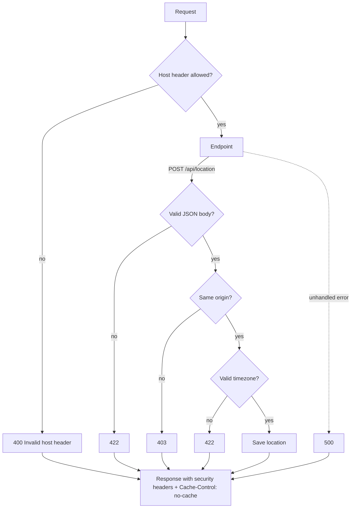

# Security

Security design and hardening of the app, including the one-time volume migration for existing installs.

Every request passes these checks:



The app is designed for a **trusted home network**:

- **LAN-only, no login by design.** There is no authentication and no per-user state. Keep it that way: **do not forward the app's port (default 8000) on your router** — if the host ever gets a public IP, an unauthenticated API would be internet-reachable. Optionally pin the publish address to the LAN IP instead of all interfaces.
- **Same-origin only.** The frontend is served by the same app as the API, so there is **no CORS**: a website opened in your browser can still send a request to the app, but without CORS headers it cannot *read* the answer — this closes the leak of the home coordinates from `GET /api/config`.
- **Location writes are same-origin JSON only** (`POST /api/location`): the no-CORS rule above stops a foreign page from *reading* the app, but a website can still *send* a POST to a LAN app without any CORS (CSRF). So the location endpoint refuses foreign `Origin` headers (and requests flagged cross-site) with `403`, and only accepts a JSON body — a cross-site HTML form (form-encoded / `text/plain`) cannot post a location either (that gets a 422).
- **Address search goes to OpenStreetMap Nominatim from the app's server.** `GET /api/geocode` forwards the text you typed in the setup wizard to `nominatim.openstreetmap.org` (the app sends the custom `User-Agent` Nominatim requires and follows its usage policy: max 1 request per second, cached results). Coordinates you type directly never leave the app.
- **Host header check (DNS rebinding).** The no-CORS defense assumes the browser treats the app as a *different origin* from a malicious site. DNS rebinding breaks that: a site whose DNS record switches to the app's LAN IP makes the browser treat the app as same-origin. So the app only answers requests whose `Host` header names it: any **IP literal**, **localhost**, any **`.local`** mDNS name (public DNS can't serve those), or extra names from the `ALLOWED_HOSTS` env variable (comma-separated, e.g. `ALLOWED_HOSTS=pi.fritz.box` for a router DNS name) — port ignored, case-insensitive. Anything else gets `400 Invalid host header`. If your browser shows "Invalid host header", the name you opened the app under is not in that list — add it via `ALLOWED_HOSTS`.
- **Security headers** on every response (API and static files), set by a small middleware in `app/main.py`:
  - `Content-Security-Policy: default-src 'self'; img-src 'self' data:; object-src 'none'; base-uri 'none'; form-action 'none'; frame-ancestors 'none'` — the page may only load resources from itself (the frontend is fully local, no CDN; `img-src data:` covers the inline favicon). Nothing can be embedded, the base URI cannot be hijacked, forms go nowhere, and the page cannot be framed by other sites. Together with the text-only DOM inserts (step 7a), this means upstream weather data can never execute as HTML/JS in your browser.
  - `X-Content-Type-Options: nosniff` — the browser may not MIME-sniff a mis-served file into an executable type.
  - `Referrer-Policy: no-referrer` — the page URL is never leaked to other origins.
  - `Cross-Origin-Resource-Policy: same-origin` — the app's files are refused as cross-origin resources.
- **API docs off by default.** `/docs`, `/redoc` and `/openapi.json` are only enabled with `ENABLE_API_DOCS=true` (see [API.md](API.md)), so a guest device on the LAN cannot browse the full API contract.
- **Non-root, read-only container.** The image runs as the unprivileged `app` user (uid/gid 1000, no home directory) on a read-only root filesystem with **all Linux capabilities dropped** and `no-new-privileges` set; the process count is capped at 200. Only the `weather-data` volume (`/data`) and a `/tmp` tmpfs are writable; the application code is owned by root, so the `app` user cannot modify it. A code-execution bug inside the container therefore runs without root, without privileges, and without a writable filesystem to hide in.

  **One-time migration for existing installs** (the old root-owned volume is not writable by the new user):

  ```bash
  podman compose down
  podman unshare chown -R 1000:1000 "$(podman volume inspect wetter_weather-data --format '{{.Mountpoint}}')"
  ```

  then start the app again (`podman compose up -d --build`).
